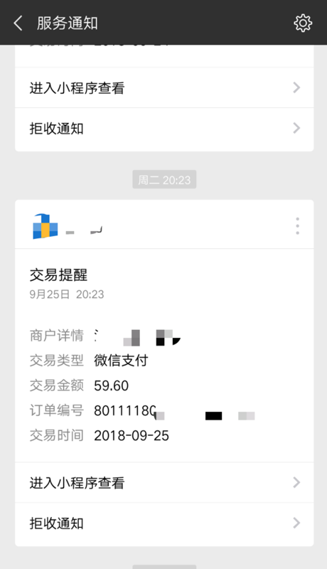

<!-- ex_nonav -->

# 发送模板消息

如果用户在执行了某一特定的操作的时候，例如用户进行了支付操作，需要给用户发送一个关于订单的相关的信息的消息的时候，可以调用该接口给特定的用户群体发送一个特定的模板消息，




`BaaS.sendTemplateMessage(data)`

**参数说明**

data 是 Object 类型，它包括以下几个属性

| 参数             | 类型   | 必填  | 说明 |
| :-------------- | :----- | :--- | :-- |
| recipient_type  | String | 是   | 推送类型，可选值： user_id、user_list、user_group、user_profile、schema_user  |
| `<recipient_params>` | Array、Integer、String、Object | 是   | 根据recipient_type来填写不同的参数名， 详见下方表格说明 |
| template_id     | String | 是   | 模板 ID |
| submission_type | String | 是   | 模板消息触发条件，`form_id` 或者 `prepay_id` |
| keywords        | Object | 是   | 关键字（可在 [知晓云-模板消息](https://cloud.minapp.com/dashboard/#/app/template-message/template) 配置）|
| schema_name     | String | 否   | 数据表名，如果 recipient_type 为 schema_user 则为必填项，表示对该表名的数据表进行用户筛选  |
| page            | String | 否   | 点击模板卡片后的跳转页面，仅限本小程序内的页面。支持带参数。该字段不填则模板无跳转。|


| recipient_type 类型 | recipient_params     | 类型            | 说明                          |
|:------------------|:---------------------|:--------------|:----------------------------|
| user_id           | user_id              | Integer       | 推送单个用户，传入用户 id              |
| user_list         | user_list            | Integer Array | 推送批量用户，传入用户 id 列表           |
| user_group        | user_group_name      | String        | 用户组名，注意这里是提交用户组名称，而不是用户组 id |
| user_profile      | user_profile_filters | String        | _userprofile 表的查询条件         |
| schema_user       | user_profile_filters | String        | 对指定数据表的查询条件，用于筛选用户        |


**请求示例 - user_id**

```js
let data = {
  recipient_type：'user_id',
  user_id: 23425,
  template_id: "tadfDf23asdi8dfd",
  submission_type: "form_id",
  keywords: {
    keyword1: {
      value: "书籍",
    },
    keyword2: {
      value: "50.5",
    }
  }
}

BaaS.sendTemplateMessage(data).then(res => {
  // 发送成功
}, err => {
  // 发送失败
})
```

**请求示例 - user_list**

```js
let data = {
  recipient_type：'user_list',
  user_list: [123, 456, 789],
  template_id: "tadfDf23asdi8dfd",
  // 其他参数
}

BaaS.sendTemplateMessage(data)
```

> **info**
> user_list 的长度不能超过 1000

**请求示例 - user_group**

```js
let data = {
  recipient_type：'user_group',
  user_group_name: '运营人员',
  template_id: "tadfDf23asdi8dfd",
  // 其他参数
}

BaaS.sendTemplateMessage(data)
```

**请求示例 - user_profile**

```js
let data = {
  recipient_type：'user_profile',
  user_profile_filters: {
    "$and": [
      {
        "is_authorize": true
      },
      {
        "array_field": {
          "$in": [
            "value_1",
            "value_2"
          ]
        }
      }
    ]
  },
  template_id: "tadfDf23asdi8dfd",
  // 其他参数
}

BaaS.sendTemplateMessage(data)
```

其中 keyword1, keyword2 为微信后台中实际关键词对应的键值


> **info**
> 如果 `submission_type = 'form_id'`，请确保在调用 `BaaS.sendTemplateMessage` 前，已在小程序端调用 `wx.BaaS.wxReportTicket`上报模版消息所需的 `formid`


## user_profile_filters 语法

| 操作符     	| 示例                                                                                                       	| 示例说明                    	|
|------------	|------------------------------------------------------------------------------------------------------------	|-----------------------------	|
| =          	| { a:{ $eq: '123' } }                                                                                       	| a == '123'       	|
| <          	| { a: { $lt: 22 } }                                                                                         	| a 小于 22                   	|
| <=         	| { a: { $lte: 22 } }                                                                                        	| a 小于等于 22               	|
| >          	| { a: { $gt: 22 } }                                                                                         	| a 大于 22                   	|
| >=         	| { a: { $gte: 22 } }                                                                                        	| a 大于等于 22               	|
| in         	| { a: { $in: [123, 456] } }                                                                                 	| a 存在于 [123, 456] , eg: 123 in [123, 456]      	|
| range      	| { a: { $range: [0, 5] } }                                                                                  	| a 存在于 [0, 1, 2, 3, 4] 中, eg: 1 in [0, 1, 2] 	|
| !=         	| { a: { $ne: '123' } }                                                                                      	| a 不等于 '123', eg '456' != '123'          	|
| not in     	| { a: { $nin: [123, 456] } }                                                                                	| a 不在 [123, 456] 中, eg: 888 不在 [123， 456] 中    	|
| contains   	| { a: { $contains: '123'} }                                                                                 	| a 包含 '123', eg: 'abc123' 包含 ‘123’         	|
| regex      	| { a: { $regex: '123', $options: 'g'} }                                                                     	| a.match(/123/g)             	|
| all        	| { a: { $all: [1, 2, 3] } }                                                                                 	| a 包含了 [1, 2, 3] , eg: [1, 2, 3] 包含了  [1, 2]  	|
| is null    	| { a: { $isnull: true} } }                                                                                  	| a 是否为空                  	|
| center     	| { a: { $center: {"radius": 123, "coordinates": [1, 2]} } }                                                 	| 请参考[withincircle](../../../js-sdk/schema/geo.md)          	|
| intersects 	| { a: { $intersects: {"type": `GEOJSON`, "coordinates": [1, 2]} }}                                          	| 请参考[include](../../../js-sdk/schema/geo.md)                	|
| nearsphere 	| { a: {"$nearsphere":{"geometry":{"type":"Point","coordinates":[1,2]},"min_distance":3,"max_distance":4}} } 	| 请参考[withinRegion](../../../js-sdk/schema/geo.md)           	|
