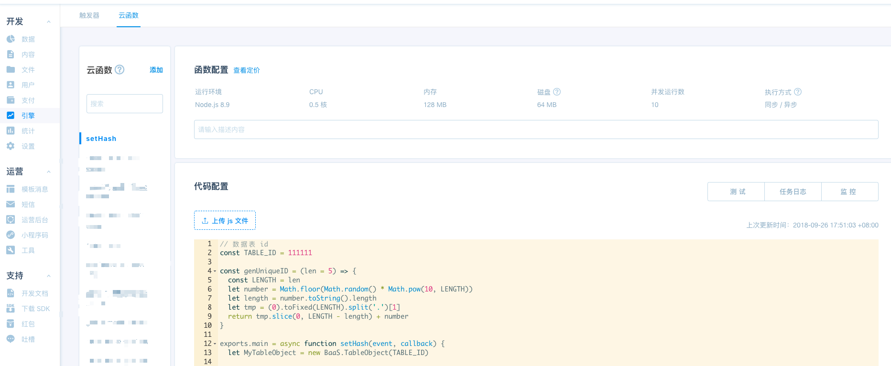
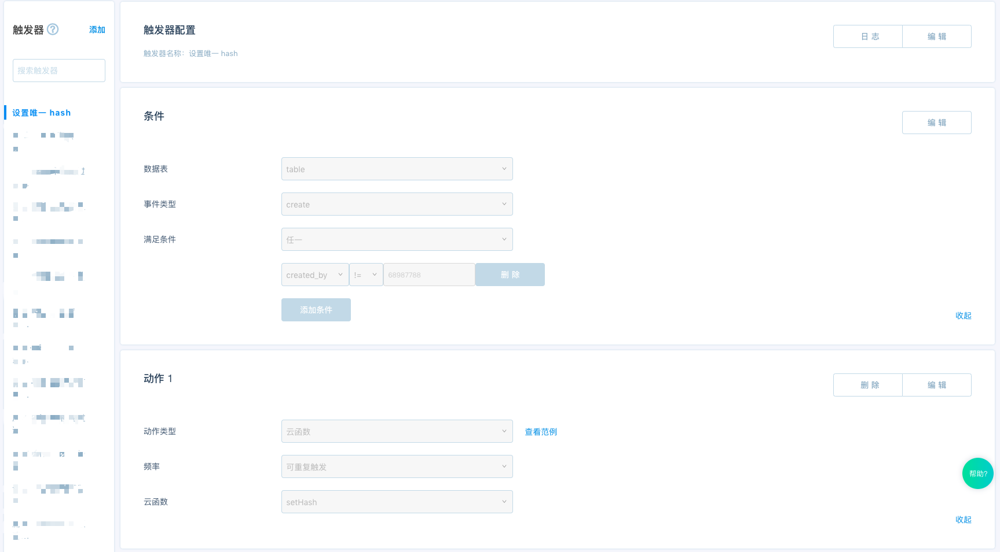

# 云函数实战教程

## 云函数介绍

云函数相关文档请[移步这里](/dashboard/cloud-function.md)

## 云函数实战

下面我们向大家展示一个云函数实战的案例。要实现的功能点：当数据表新增一条数据时，通过触发器调用云函数，云函数再对该条数据的 hash 字段进行修改操作。生成的每一行数据的 hash 字段值都是唯一的，比起 id 更加简短，利于用户在其他地方使用。

#### 准备工作
我们先在数据页面，创建一个 table 数据表，然后添加如下一个字段：

| 字段名称 | 类型     |
|------|--------|
| hash | string |

#### 创建云函数 setHash



```javascript
// 数据表 id
const TABLE_ID = 111111

const genUniqueID = (len = 5) => {
  const LENGTH = len
  let number = Math.floor(Math.random() * Math.pow(10, LENGTH))
  let length = number.toString().length
  let tmp = (0).toFixed(LENGTH).split('.')[1]
  return tmp.slice(0, LENGTH - length) + number
}

exports.main = async function setHash(event, callback) {
  let MyTableObject = new BaaS.TableObject(TABLE_ID)

  while (true) {
    let hash = 'c' + genUniqueID()

    // 设定查询条件
    let query = new BaaS.Query()
    query.compare('hash', '=', hash)

    // 根据指定条件查询数据
    let res = await MyTableObject.setQuery(query).find()

    // 如数据表已存在该 hash ,则重新生成 hash 值
    if (res.data.objects.length > 0) {
      continue;
    }
    
    // event.data.id 为触发该云函数的当前数据行 id
    let MyRecord = MyTableObject.getWithoutData(event.data.id)

    // 更新 hash 字段值
    await MyRecord.set('hash', hash)
    await MyRecord.update()
    return callback(null, 0)
  }
}
```

#### 创建触发器

触发类型为数据表，设定触发条件为数据表的 create 操作，触发动作为 调用云函数 setHash



#### 测试云函数

在 table 数据表中新增一行数据，hash 字段不用赋值。之后触发器就会被你的 create 操作触发，从而调用 setHash 云函数，最后 hash 字段的值就被更新了。如下：


云函数调用日志如下：


